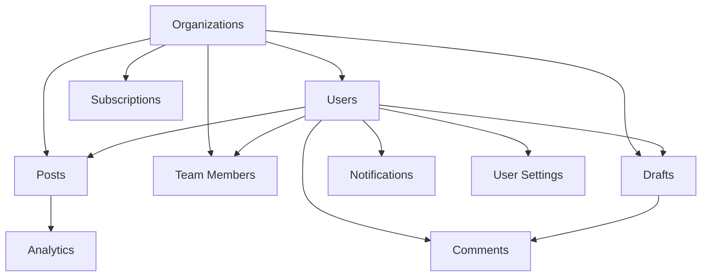

# Database Seeding Script Enhancement Design

## Overview

This document outlines the design for enhancing the existing database seeding script to include comprehensive sample data for all tables in the ContentFlow application. Currently, the seed script only creates a basic organization and user, but the application has many more entities that would benefit from sample data for development and testing purposes.

## Architecture

The enhanced seeding script will follow a modular approach where each entity type is handled separately but in a coordinated sequence to maintain referential integrity. The script will:

1. Check for existing data to avoid duplication
2. Create sample data for all entity types in the correct order
3. Establish proper relationships between entities
4. Provide informative console output during the seeding process

### Script Structure

The enhanced seeding script will be organized as follows:

```javascript
// Main seeding function
async function main() {
  try {
    // Initialize Prisma client
    const prisma = new PrismaClient();
    
    // Execute seeding functions in order
    await seedOrganizations(prisma);
    await seedUsers(prisma);
    await seedSubscriptions(prisma);
    await seedPosts(prisma);
    await seedAnalytics(prisma);
    await seedTeamMembers(prisma);
    await seedDrafts(prisma);
    await seedComments(prisma);
    await seedNotifications(prisma);
    await seedUserSettings(prisma);
    
    console.log("Seeding completed successfully!");
  } catch (error) {
    console.error("Seeding failed:", error);
    process.exit(1);
  } finally {
    await prisma.$disconnect();
  }
}

// Individual seeding functions
async function seedOrganizations(prisma) { /* ... */ }
async function seedUsers(prisma) { /* ... */ }
async function seedSubscriptions(prisma) { /* ... */ }
// ... additional functions
```

Each seeding function will:
1. Check for existing data to prevent duplication
2. Generate appropriate sample data
3. Create entities with proper relationships
4. Handle errors gracefully
5. Provide console feedback

## Data Models & Relationships

Based on the Prisma schema, the following entities need to be seeded with sample data:

1. **Organization** - Already partially implemented
2. **User** - Already partially implemented
3. **Subscription** - Related to Organization
4. **Post** - Related to User and Organization
5. **Analytics** - Related to Post
6. **TeamMember** - Related to User and Organization
7. **Draft** - Related to User and Organization
8. **Comment** - Related to Draft and User
9. **Notification** - Related to User
10. **UserSetting** - Related to User

## Seeding Logic Design

### 1. Organization Seeding
```
// Enhanced organization creation with more realistic sample data
const organizations = [
  {
    name: 'Test Company',
    slug: 'test-company'
  },
  {
    name: 'Acme Corporation',
    slug: 'acme-corp'
  },
  {
    name: 'Globex Inc.',
    slug: 'globex-inc'
  }
];
```

### 2. User Seeding
```
// Enhanced user creation with more diverse sample data
const users = [
  {
    email: 'admin@testcompany.com',
    firstName: 'Test',
    lastName: 'Administrator',
    subscriptionTier: 'enterprise',
    industry: 'Technology',
    jobTitle: 'CTO',
    bio: 'Tech lead with 10+ years of experience',
    timezone: 'America/New_York'
  },
  {
    email: 'editor@testcompany.com',
    firstName: 'Jane',
    lastName: 'Editor',
    subscriptionTier: 'professional',
    industry: 'Marketing',
    jobTitle: 'Content Editor',
    bio: 'Content specialist focused on LinkedIn growth',
    timezone: 'America/Chicago'
  }
];
```

### 3. Subscription Seeding
```
// Sample subscriptions for different tiers
const subscriptions = [
  {
    tier: 'starter',
    status: 'active',
    aiCreditsLimit: 5,
    aiCreditsUsed: 2
  },
  {
    tier: 'professional',
    status: 'active',
    aiCreditsLimit: 50,
    aiCreditsUsed: 35
  },
  {
    tier: 'enterprise',
    status: 'active',
    aiCreditsLimit: 500,
    aiCreditsUsed: 245
  }
];
```

### 4. Post Seeding
```
// Sample posts with different statuses and content
const posts = [
  {
    content: 'Just launched our new product! Excited to see how it performs in the market. #productlaunch #innovation',
    tone: 'professional',
    industry: 'Technology',
    status: 'published',
    aiGenerated: true
  },
  {
    content: 'Working late on an exciting new feature that will revolutionize how teams collaborate. Stay tuned for updates!',
    tone: 'casual',
    industry: 'Software',
    status: 'draft',
    aiGenerated: false
  }
];
```

### 5. Analytics Seeding
```
// Sample analytics data for posts
const analytics = [
  {
    impressions: 1250,
    likes: 42,
    comments: 8,
    shares: 15,
    clickThroughRate: 3.25
  },
  {
    impressions: 875,
    likes: 28,
    comments: 5,
    shares: 7,
    clickThroughRate: 2.10
  }
];
```

### 6. Team Member Seeding
```
// Sample team members with different roles
const teamMembers = [
  {
    role: 'admin',
    status: 'active'
  },
  {
    role: 'editor',
    status: 'active'
  },
  {
    role: 'viewer',
    status: 'pending'
  }
];
```

### 7. Draft Seeding
```
// Sample drafts with different statuses
const drafts = [
  {
    content: 'Draft content for review. Please provide feedback on tone and messaging.',
    status: 'draft',
    version: 1
  },
  {
    content: 'Final version ready for approval. All feedback has been incorporated.',
    status: 'pending_approval',
    version: 3
  }
];
```

### 8. Comment Seeding
```
// Sample comments on drafts
const comments = [
  {
    content: 'This looks great! Just a few minor suggestions for improvement.',
    type: 'comment'
  },
  {
    content: 'Please add more data to support the claims in paragraph 2.',
    type: 'suggestion'
  }
];
```

### 9. Notification Seeding
```
// Sample notifications for users
const notifications = [
  {
    type: 'post_scheduled',
    title: 'Post Scheduled',
    message: 'Your post has been scheduled for publication tomorrow at 9:00 AM.'
  },
  {
    type: 'draft_comment',
    title: 'New Comment',
    message: 'Jane Editor has commented on your draft.'
  }
];
```

### 10. User Setting Seeding
```
// Sample user settings
const userSettings = [
  {
    emailNotifications: true,
    postReminders: true,
    analyticsReports: true,
    teamUpdates: true,
    marketingEmails: false,
    profileVisibility: 'team',
    dataSharing: false,
    analyticsTracking: true
  }
];
```

## Implementation Sequence

To maintain referential integrity, the seeding will follow this sequence:



1. Organizations (no dependencies)
2. Users (depends on Organizations)
3. Subscriptions (depends on Organizations)
4. Posts (depends on Users and Organizations)
5. Analytics (depends on Posts)
6. Team Members (depends on Users and Organizations)
7. Drafts (depends on Users and Organizations)
8. Comments (depends on Drafts and Users)
9. Notifications (depends on Users)
10. User Settings (depends on Users)

## Data Consistency and Validation

To ensure data consistency and validity, the seeding script will implement:

1. **Data Validation**: All sample data will be validated against the Prisma schema constraints
2. **Referential Integrity**: Foreign key relationships will be properly maintained
3. **Unique Constraints**: Unique fields will be checked to prevent duplication
4. **Data Consistency**: Related entities will have consistent data (e.g., timestamps, status transitions)

## Error Handling

The enhanced seeding script will include proper error handling:

1. Try-catch blocks around each entity creation
2. Graceful handling of existing data
3. Informative error messages
4. Proper cleanup on failure

## Testing Strategy

Unit tests will be implemented to verify:

1. Data creation for each entity type
2. Relationship establishment between entities
3. Proper handling of existing data
4. Error handling scenarios

## Implementation Plan

The enhanced seeding script will be implemented in the following phases:

### Phase 1: Core Entities
- Enhance Organization seeding with multiple sample organizations
- Enhance User seeding with diverse user profiles
- Implement Subscription seeding with different tiers

### Phase 2: Content Entities
- Implement Post seeding with various content types
- Implement Analytics seeding with realistic metrics
- Implement Draft seeding with different workflow states

### Phase 3: Collaboration Entities
- Implement Team Member seeding with various roles
- Implement Comment seeding with different comment types
- Implement Notification seeding with various notification types

### Phase 4: User Preferences
- Implement User Setting seeding with different preference combinations

### Phase 5: Testing and Validation
- Implement unit tests for each seeding function
- Validate data relationships and integrity
- Test error handling scenarios

## Benefits

1. **Development Efficiency**: Developers will have realistic sample data to work with
2. **Testing Coverage**: All entity types will be populated with sample data
3. **Demo Capability**: Sales and product demos will have rich sample data
4. **Integration Testing**: Complete data sets will enable comprehensive testing
